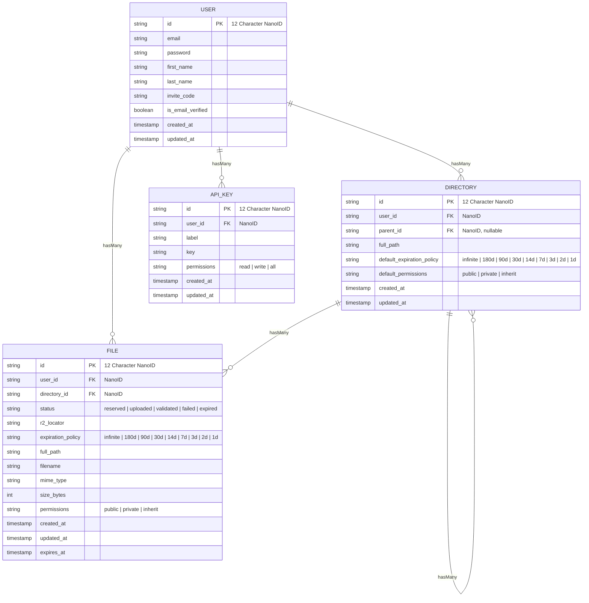

Hulkastorus Technical Design Specification
------------------------------------------

# Overview

This document defines the technical design of **Hulkastorus**, a developer-focused cloud-storage service that turns a drag-and-drop or single `curl` command into an immediately usable public URL.

Traditional platforms (GDrive, S3) slow innovation with hidden IDs, OAuth flows, bucket semantics, and heavyweight SDKs. Hulkastorus removes that friction.

We solve the problem with an opinionated NextJS/Vercel web app, a two-endpoint REST API, and Cloudflare R2 object storage, enforcing privacy/expiry policies only when explicitly requested.

# Terminology

* **R2** – Cloudflare’s S3-compatible object store with zero-egress fees.
* **Pseudo-ID** – 12-character NanoID stable across renames; used in public URLs.
* **Expiry Rule** – policy that hard-deletes objects N days after upload.

# Background

Developers routinely need to shift large artifacts (models, datasets, archives) between machines that have no GUI or OAuth capabilities.
Existing options impose unnecessary ceremony:

* **Google Drive** – Requires OAuth tokens and link unwrapping; headless servers choke on confirmation redirects.
* **Amazon S3** – Expects bucket creation, region selection, ACL tuning, and SDK credentials.
* **Self-hosted MinIO / IPFS** – Adds operational burden.

Internal prototypes show engineers wasting \~30 min per file share, multiplying across CI pipelines and research workflows.
Hulkastorus eliminates 90% of that overhead with a single POST+PUT interaction backed by R2 and minimal metadata in Postgres.

# Goals

* **Shrink time-to-share** a 1 GB file to **<30 s** from dashboard or CLI.
* **Eliminate SDK dependency**: everything possible with `curl` and a prefilled URL.
* **Maintain privacy** defaults: no unauthenticated browse of non-public files.
* **Hold p95 download latency** < 250 ms for files < 50 MB (USA).
* **Cap operational cost** to ≤ \$0.004 / GB-month inclusive of egress.

# Non-Goals

* Provide fine-grained IAM or role hierarchies.
* Offer versioning or soft-delete retention.
* Compete with full-featured object stores for petabyte-scale archives.

# Proposed Solution

Hulkastorus consists of **four** cooperating components whose code is hosted in a new `hulkastorus` GitHub repository.

- **Web Server** - a Vercel-hosted NextJS app (App Router) providing both a web frontend and a REST API.
- **Cron Jobs** - Vercel-hosted cron jobs for deleting expired files and refreshing user quotas.
- **Storage Layer** - an R2 Storage Bucket for storing the files themselves.
- **Database** - a Neon Postgres Database for all other persistent data.

## Web Server

A Vercel-hosted NextJS app that serves both the web frontend, REST API, and cron job endpoints.

### Pages

The following pages are implemented with React server components and server actions.

- `/`
- `/docs`
- `/login`
- `/register`
- `/reset-password`
- `/app/dashboard`
- `/app/browse/:path`
- `/app/settings`

Each REST API route's underlying logic is referenced by pages as a server action.
See [Page Details](#Page-Details) for more information.

### REST API Routes

The following REST API routes are implemented:

- POST /api/v1/users (create a new user)
- GET /api/v1/users/:id (get user metadata)
- GET /api/v1/users/:id/usage (get user quota and usage stats)
- PUT /api/v1/users/:id (update a user basic profile info)
- POST /api/v1/users/:id/email-verification (sends a verification email)
- PUT /api/v1/users/:id/email-verification (verify a user's email address)
- PUT /api/v1/users/:id/password (update a user's password)
- DELETE /api/v1/users/:id (delete a user)
- GET /api/v1/api-keys (list API keys)
- POST /api/v1/api-keys (create a new API key)
- DELETE /api/v1/api-keys/:key_id (delete an API key)
- GET /api/v1/directories (list directories)
- GET /api/v1/directories/:id (get directory metadata)
- POST /api/v1/directories (create a new directory)
- DELETE /api/v1/directories/:id (delete a directory)
- PUT /api/v1/directories/:id (rename, move, set permissions or expiry a directory)
- GET /api/v1/files (list files)
- GET /api/v1/files/search (search for files)
- POST /api/v1/files (start uploading a new file)
- DELETE /api/v1/files/:id (delete a file)
- PUT /api/v1/files/:id (rename, move, set permissions or expiry for a file)
- PUT /api/v1/files/:id/status (trigger file metadata update post-upload)
- GET /api/v1/files/:id (get file metadata)
- GET /api/v1/files/:id/download (get a download URL for a file)


See [REST API Route Details](#REST-API-Route-Details) for more information.

### Pageless Routes

The following routes do not have a page component, nor are intended for REST-like usage.

#### GET `/logout`

Destroys the session token.

#### GET `/verify-email?token=TOKEN`

Verifies a user's email address with a valid, unexpired JWT.
Identical behavior to PUT `/api/v1/users/:id/email-verification` but with a GET method and a public-facing URL.

#### GET `/d/:pseudo_id[?token=TOKEN]`

Identical behavior to GET `/api/v1/files/:id/download`, just friendlier, public-facing URL.

### UI Components

Shared UI Components follow the Shadcn UI component library pattern.
Common components, unless otherwise specified, are sourced from Shadcn's default radix-ui implementation.

### Key Decisions

- **Runtime**: NextJS 15 App Router
- **Auth**: NextAuth with JWT
- **UI<->DB Communication**: server actions, duplicated functionality in REST API routes for CLI
- **Rate-Limiting**: Vercel Edge Config

## Cron Jobs

* **OrphanSweep** – every 6h delete R2 objects with no matching row + mark rows with missing R2 objects.
* **ExpirySweep** – every 6h mark expired file rows for deletion.

## Storage Layer

All files are stored in the `hulkastorus-ugc` bucket on Cloudflare R2.

### Key Decisions
* **Bucket layout**: `<env>/<lifecycle_policy>/<user_id>/<file_id>`
* **Lifecycle rules**: bucket-level rules delete files in the lifecycle policy prefix after a set period.
* **Object ACL**: always private; public access only via signed URL.

## Database

All user-related data is stored in a `hulkastorus` Postgres database on Neon.
Connections and migrations are made via Prisma in the NextJS app.

### Key Decisions

* **Flavor**: Neon Postgres
* **Schema**: row-level ownership data prevents cross-tenant leakage.
* **Branching**: Neon’s branching enables preview environments per PR.
* **Migrations**: Prisma migrations are executed on service startup.

# Appendix

## Database Schema



## Page Details

### Homepage (`/`)

The marketing page with mostly static content.

#### Design

+----------------------------------------------------------------------------------+
| Hulkastorus logo (hex-dino)              | Docs | Pricing | Login | [ Get Beta ] |
+----------------------------------------------------------------------------------+

|  ┌───────────────────────────── HERO ───────────────────────────────┐            |
|  |  BIG HEADLINE: “Dev-Friendly Cloud                               |            |
|  |                Storage, Hulk-Strong.”                            |            |
|  |  Sub-text: “Instant public URLs & frictionless CLI / Python      |            |
|  |  uploads — minus the SDK bloat.”                                 |            |
|  |                                                                  |            |
|  |  [ Request an Invite ]   [ Read the Docs ]                       |            |
|  └───────────────────────────────────────────────────────────────────┘            |
|                             [ Hulk-dino illustration ]                           |

|  ┌──────────── THREE FEATURE CARDS ────────────┐                                 |
|  | ⚡ One-Command Share  | ↻ Keyless Auth Flow | 📦 ML-Asset Ready               |
|  | Ship files at Raptor | Works with GitHub   | Multipart, resumable uploads;   |
|  | speed; `hulk put,★`  | SSO / cloud IAM;    | content-addressed caching;      |
|  | → link auto-copied & | zero keys in CI     | MD5 + SHA-256 integrity         |
|  | posted to Slack      |                     |                                 |
|  └─────────────────────────────────────────────┘                                 |

|  ┌──────── CODE SNIPPET ────────┐   ┌────────── TESTIMONIAL ──────────┐          |
|  | Tabs: [ Bash ] [ Python ]    |   | “We swapped S3 presign dance    |          |
|  | $ hulk put model.ckpt        |   | for Hulkastorus in an afternoon.|          |
|  | https://hulk.st/or.us/abc123 |   | Links just work.”               |          |
|  | — copied to clipboard ✅      |   |        — ML Infra Lead, VFX Co. |          |
|  └──────────────────────────────┘   |  [ Request Early Access ]       |          |
|                                     └─────────────────────────────────┘          |

|  ┌─────────────── LOGO CAROUSEL ───────────────┐                                 |
|  |  Hooli ◈ Pied Piper ◈ Enron ◈ Theranos ◈   … |  (monochrome, auto-scrolls)   |
|  └──────────────────────────────────────────────┘                                 |

|  ┌─────────────── PRICING COMPARISON ───────────────┐                            |
|  | Plan          | Free            | Pro             | Tres Commas              |
|  |---------------|-----------------|-----------------|--------------------------|
|  | Monthly cost  | **$0** (beta)   | **$0** (beta)   | **$0** (beta)            |
|  | Storage cap   | 10 GB           | 1 TB            | Unlimited                |
|  | Bandwidth     | 50 GB/mo        | 1 TB/mo         | Unlimited                |
|  | Support       | Community       | 24 h SLA        | Dedicated TAM            |
|  | CTA           | [ Get Free ]    | [ Join Waitlist ] | [ Contact Sales ]      |
|  └───────────────────────────────────────────────────┘                            |

|  Footer: © 2025 Hulkastorus • Privacy • Terms • Twitter                           |
+----------------------------------------------------------------------------------+


#### Common Components Needed

| Component         | Source |
| ----------------- | ------ |
| Top Navbar        | Custom |
| Tabbed Code Block | Custom |
| Tabs              | Shadcn |
| Button            | Shadcn |

#### Server Actions Needed

None.

### Docs (`/docs`)

#### Design

See [Homepage](#Homepage-homepage)

#### Common Components Needed

| Component         | Source |
| ----------------- | ------ |
| Top Navbar        | Custom |
| Tabbed Code Block | Custom |
| Tabs              | Shadcn |
| Button            | Shadcn |

#### Server Actions Needed

None.

### Login (`/login`)

#### Design

+----------------------------------------------------------------------------------+
| Hulkastorus logo (hex-dino, top-left)                  |  [ ← Back to Home ]     |
+----------------------------------------------------------------------------------+
|                                                                              |
|  ┌──────────────────────────── LOGIN PANEL ──────────────────────────────┐  |
|  |                                                                      |  |
|  |   HEADLINE: “Welcome back, beast.”                                   |  |
|  |   Subtext: “Log in to crush some bytes.”                             |  |
|  |                                                                      |  |
|  |   ┌────────────────────────────┐      ┌────────────────────────────┐ |  |
|  |   | Email                     ⌄|      | Password                  ⌄| |  |
|  |   └────────────────────────────┘      └────────────────────────────┘ |  |
|  |                                                                      |  |
|  |   [🦖 Log In]        [ Forgot your password? ]                        |  |
|  |                                                                      |  |
|  |   Don’t have an account? [ Sign up → ]                               |  |
|  └──────────────────────────────────────────────────────────────────────┘  |
|  ┌────────── FOOTER STRIP ──────────┐                                      |
|  | © 2025 Hulkastorus | ToS | GDPR  |                                      |
|  └──────────────────────────────────┘                                      |
+------------------------------------------------------------------------------+


#### Common Components Needed

| Component         | Source |
| ----------------- | ------ |
| Top Navbar        | Custom |
| Card              | Shadcn |
| Input             | Shadcn |
| Button            | Shadcn |
| Toast             | Shadcn (Sonner) |

#### Server Actions Needed

- NextAuth `signIn`
- **`requestPasswordResetEmail`**
    - Sends a password reset email to the user.

### Register (`/register`)

#### Design

+----------------------------------------------------------------------------------+
| hex-dino logo                              |  [ ← Back Home ]                    |
+----------------------------------------------------------------------------------+
|                                                                                  |
| ┌───────────────────────── SIGN-UP PANEL ──────────────────────────┐              |
| | HEADLINE: “Join the private beta.”                              |              |
| | First Name  [________________________]                          |              |
| | Last Name   [________________________]                          |              |
| | Email       [________________________]                          |              |
| | Password    [________________________]                          |              |
| | Confirm Password    [________________________]                  |              |
| | Invite Code [________________________]                          |              |
| |                                                                [🦖 Create Account]|
| | Already registered?  Log in →                                   |              |
| └──────────────────────────────────────────────────────────────────┘              |
+----------------------------------------------------------------------------------+


#### Common Components Needed

| Component         | Source |
| ----------------- | ------ |
| Top Navbar        | Custom |
| Card              | Shadcn |
| Input             | Shadcn |
| Button            | Shadcn |

#### Server Actions Needed

- POST /api/v1/users

### Reset Password (`/reset-password`)

#### Design

See [Login](#Login-login)

#### Common Components Needed

| Component         | Source |
| ----------------- | ------ |
| Top Navbar        | Custom |
| Card              | Shadcn |
| Input             | Shadcn |
| Button            | Shadcn |

#### Server Actions Needed

- **`resetPassword`**
    - Validates the reset token.
    - Updates the password in Postgres.
    - Redirects to login with a success message.

### Dashboard (`/app/dashboard`)

The authenticated home screen where users upload, browse, and manage their stored files and directories.

#### Design

+---------------------------------------------------------------+
|  DRAG-AND-DROP ZONE  (“Drop files or click to browse…”)       |
+-----------------------------+---------------------------------+
| Recent Uploads              | Usage Stats                     |
| ┌──────────────┐            | Total Used: ▇▇▇▇▇ 56 GB / 100 GB|
| | model.ckpt  | … |        | Top Types: .ckpt, .zip, .jpg     |
| └──────────────┘            | Expiring Soon: 4 files          |
+-----------------------------+---------------------------------+


#### Common Components Needed

| Component                        | Source              |
| -------------------------------- | ------------------- |
| App Shell (Top Navbar + Sidebar) | Custom              |
| Checkbox                         | Shadcn              |
| Button / IconButton              | Shadcn              |
| Progress Bar                     | Shadcn              |
| Modal / Dialog                   | Shadcn              |
| Toast (Sonner)                   | Shadcn              |
| Drop-zone (drag-and-drop)        | react-dropzone      |
| Context Menu                     | Shadcn              |

#### Server Actions Needed

- GET /api/v1/users/:id/usage
- POST /api/v1/files
- PUT /api/v1/files/:id/status

### File Manager (`/app/browse/:path`)

A deep-linkable file manager that pre-loads the directory given in `:path`.
This page contains most of the UI for interacting with files.
URL changes push/pop state so the browser’s back button walks the folder tree.

#### Design

+ Breadcrumbs:  /  >  datasets/  >  2025/
+----------------------------------------------------------------------------------+
| 🔍 [ filter… ]                                    |  [ New Folder ]  [ Upload ]  |
|----------------------------------------------------------------------------------|
| Name                | Size   | Modified          | Perm | Expires | … [⚙]       |
| 📄 model.ckpt        | 2.1 GB | 2025-06-04 14:12  | 🌐   | —       | […]        |
| 📄 notes.txt         | 4 KB   | “                 | 👤   | 2025-07-01 | …        |
| 📁 images/           | —      | 2025-06-01        | 👤   | —       | …          |
|----------------------------------------------------------------------------------|
+----------------------------------------------------------------------------------+


#### Common Components Needed

| Component           | Source |
| ------------------- | ------ |
| (Same as Dashboard) | —      |
| Table               | Shadcn |


#### Server Actions Needed

Re-use the Dashboard server actions plus the following:

- POST /api/v1/directories
- GET /api/v1/files
- GET /api/v1/files/search
- PUT /api/v1/directories/:id
- PUT /api/v1/files/:id
- DELETE /api/v1/directories/:id
- DELETE /api/v1/files/:id

### Settings (`/app/settings`)

A four-section management area for user profile, API keys, personal preferences, and account deletion.

#### Design

+----------------------------------------------------------------------------------+
| ── Profile ────────────────────────────────────────────────────────────────────── |
|  Name:        [ Patrick Hulce        ]                                           |
|  Email:       [ patrick@example.com  ]   (✓ verified)                            |
|                                                                                  |


| ── Reset Password ─────────────────────────────────────────────────────────────── |
|  Current Password:    [ ****** ]   (hidden if forget token is set)                |
|  New Password:    [ ****** ]                                                      |
|  Confirm New Password:    [ ****** ]                                              |
|  [ Reset Password ]                                                               |
|                                                                                   |

| ── API Keys ────────────────────────────────────────────────────────────────────── |
|  Existing Keys                     |  Create New Key                             |
|  ┌───────────────────────────────┐ |  Label:  [___________]                      |
|  | Label          Last Used      | |  Perms: ☐ read   ☐ write                   |
|  | default-cli     2 h ago       | |  [➕ Generate & Copy]                       |
|  | datasets-svc    never         | |                                            |
|  └───────────────────────────────┘ |                                            |
|                                                                                  |

| ── Danger Zone ─────────────────────────────────────────────────────────────────── |
|                       [ 🔥 Delete Account ]                                       |
|                                                                                  |
+----------------------------------------------------------------------------------+


#### Common Components Needed

| Component         | Source |
| ----------------- | ------ |
| Form              | Shadcn |
| Input             | Shadcn |
| Switch / Checkbox | Shadcn |
| Button            | Shadcn |
| Table             | Shadcn |
| IconButton        | Shadcn |
| Modal / Dialog    | Shadcn |
| Toast (Sonner)    | Shadcn |

#### Server Actions Needed

- GET /api/v1/users/:id/usage
- GET /api/v1/api-keys
- POST /api/v1/api-keys
- DELETE /api/v1/api-keys/:id
- PUT /api/v1/users/:id
- PUT /api/v1/users/:id/password
- DELETE /api/v1/users/:id

## REST API Route Details

Most of the REST API routes are simple CRUD operations on the database.
The few exceptions are documented below.

### List Endpoints

All list endpoints support the following query parameters:

- `limit`: number of results to return, default 10
- `offset`: number of results to skip, default 0
- `order_by`: field (and optional direction) to sort by, default `order_by=created_at+desc`
- `filter~PROPERTY`: filter results by a property, e.g. `filter~permissions=public`

### POST /api/v1/users

Creates a new user, along with a default directory, API key, and triggers verification email flow.
Requires submission of an invite code "WELCOMETOTHEPARTYPAL".

### GET /api/v1/users/:id/usage

Returns the user's usage data that powers the dashboard.

```typescript
interface CountByType {
    total: number;
    images: number;
    videos: number;
    audios: number;
    models: number;
    datasets: number;
    documents: number;
    other: number;
}

interface Usage {
    file_counts: CountByType;
    byte_counts: CountByType;
    quota_bytes: number;
}
```

### POST /api/v1/files

Creates a new file record as a placeholder for the uploaded file.
Rejects if the user is not email verified.
Rejects if the user has exceeded their quota.
File record status is `reserved` until the client uploads the file.
Directories are autocreated on-the-fly when a file is uploaded into a non-existent path.
Does not accept file content directly; just returns a presigned URL for the client to upload to.

### PUT /api/v1/files/:id/status

Called with `{"status": "uploaded"}` after the client uploads the file.
Triggers validation of the file's content in R2 and transitions the file to `validated` or `failed`.

### POST /api/v1/users/:id/email-verification

Uses mailgun to send a verification email to the user.
Does nothing if the user is already verified.
The verification token is a JWT with the user's ID as the subject, 1 hour expiration, and email address as the claim.

### PUT /api/v1/users/:id/email-verification

Verifies a user's email address in the database.
Requires a valid, unexpired email verification token.

### GET /api/v1/files/:id/download

Redirects to a presigned URL for downloading the file.
ID is parsed into a file ID (NanoID) or a user ID + path, used to look up the file metadata.
Performs the following authorization checks:

- If a NextAuth JWT is present, use that user for authorization.
- If an API key is present, use that user for authorization.
- If a token is present, use that user for authorization.
- If no authorization is present, return 404.

# Hulkastorus Product Design

Hulkastorus removes the overhead that traditional cloud-storage products impose on developers who only need a public link or a quick programmatic upload. Google Drive hides links behind IDs and OAuth; Amazon S3 forces users to reason about buckets, regions, and SDKs. These frictions slow experimentation, inflate scripts, and confuse teammates.

Hulkastorus supplies a single-purpose alternative. A minimal web UI, a two-endpoint REST API, and opinionated defaults let users drag-and-drop a file or issue one curl command and immediately receive a stable URL backed by Cloudflare R2. Optional per-directory rules cover the 10% of cases that need privacy or expiry without burdening the 90% that do not.

# Use Cases

## Share to Constrained Environments

**Persona**: Evelyn, data scientist, shares large databases with her team.
**Goal**: share a 3 GB database so her team can test it on their own cloud servers.
**Frustration**: S3 is permissions overkill and requires SDKs to download; Drive links aren't curlable on headless instances.

**Flow**:

1. Evelyn opens the Hulkastorus Dashboard, drags `massive-database.sqlite` into the drop Zone
2. A modal appears with a progress bar, permissions settings, and a (currently disabled) action bar.
3. The UI shows “Uploaded ✔︎” when finished and she clicks "View in Manager" from the action bar to view its location in the Hulkastorus File Manager.
4. She selects the "Copy as curl" button and pastes the command into a Slack message for her team.
5. Her teammate, Dr. Chen, runs the command his headless server to download the file without any credentials or API keys.

## Share from Constrained Environments

**Persona**: Maya, graduate student, iterates on diffusion models nightly.
**Goal**: share her latest checkpoint from her headless server
**Frustration**: S3 is permissions overkill and requires SDKs to upload; her local bandwidth is limited and she doesn't want to upload twice.

**Flow**:

1. Maya opens the Hulkastorus Dashboard, clicks "Upload".
2. A modal appears where she selects the "Remote File" option.
3. She copies and pastes the a curl command that appears in the upload modal onto her headless server.
4. She clicks "finished" to trigger verification.
5. The UI shows "Uploaded" and she clicks "View in Manager" from the action bar to view its location in the file manager.
6. She selects the "Copy as curl" button and pastes the command into a Slack message for her team.

## Share Expendable Files

**Persona**: John, photographer, regularly shares large temporary previews.
**Goal**: share a 4GB image archive with his clients.
**Frustration**: cloud storage space is expensive and he doesn't want the burden of deleting old files.

**Flow**:

1. John opens the Hulkastorus Dashboard, drags `images.zip` into the drop zone, and watches an inline progress bar.
2. He selects "Set expiry" from the action bar and sets it to 7 days.
3. The UI shows “Uploaded ✔︎” and he clicks "Copy URL" from the action bar to copy the public URL to his clipboard.
4. He sends the URL to his clients via email.
5. His clients download the file by opening the URL in their browser.
6. The file is automatically deleted after 7 days, freeing up space in his cloud storage quota.

# Surfaces

## Homepage

**Contents**
- Navbar (logo, "Docs", "Pricing", "Login", "Request Invite" CTA)
- Hero header (mascot, one-line value prop, "Request Invite" CTA, "Read the Docs" secondary CTA)
- Three feature highlight cards
- Code block with example API call
- Logo carousel (fictional logos - Hooli, Pied Piper, Enron, Theranos, etc.)
- Pricing comparison table "Free", "Pro", "Tres Commas" (all free in beta)
- Footer (Copyright, Privacy, Terms)

**Visual Design**
- Single-scroll dark mode canvas.
- Centered hero container, 40% vertical viewport height.
- Feature cards are equal-width with subtle elevation.
- Logo carousel is horizontal and features monochromatic, semi-transparent, fictional company logos.

**Product Behavior**
- Logged-in users auto-redirect to **Dashboard** unless coming from the dashboard (query param).
- "Request Invite" CTA is mailto invites@hulkastor.us
- Sticky top nav on scroll.


## Documentation

**Contents**
- Navbar (logo, "Docs", "Pricing", "Login", "Request Invite" CTA)
- Sidenav listing topics
- Technical documentation sections
    - Getting Started
    - API Reference
    - FAQ
- Copyable code snippets with default API key prefilled
- Footer (Copyright, Privacy, Terms)

**Visual Design**
- Two-pane layout, 260px fixed sidenav.
- Code blocks on washed-dark background; body text max-width 720 px.
- Sticky search bar with subtle shadow.

**Product Behavior**
- Sidenav highlights section in viewport.
- Copy-link icon adjacent to H2+ anchors copies URL with hash anchor.
- External links open new tab.


## Login

**Contents**
- Login card
    - Email input
    - Password input
    - Login button
    - Forgot password toggle
    - Register link
- Footer (Copyright, Privacy, Terms)

**Visual Design**
- Card centered on a dark background with hexagonal logo and overlays, max-width 360px.
- Minimal shadow, rounds 8px.
- Inputs centered full-width with margin.

**Product Behavior**
- Redirects to dashboard if already logged in on load.
- Forgot password toggle hides the password input and changes copy to reset language.
- Failure triggers shake animation and toast error message.
- Successful login sets JWT and routes to denied surface (default **Dashboard**).

## Register

**Contents**
- Register card
    - Name input
    - Email input
    - Password input
    - Confirm password input
    - Invite code input
    - Register button
    - Login link
- Footer (Copyright, Privacy, Terms)

**Visual Design**
- Card centered on a dark background with hexagonal logo and overlays, max-width 360px.
- Minimal shadow, rounds 8px.
- Inputs centered full-width with margin.

**Product Behavior**
- Redirects to dashboard if already logged in on load.
- Failure triggers shake animation and toast error message.
- Successful registration sets JWT and redirects to Dashboard.
- New account automatically creates the default directory and API key.

## Verification Email

**Contents**
- Message with a link to verify the email address.

**Visual Design**
- None, plain text.

**Product Behavior**
- Redirects to dashboard if already logged in.
- Redirects to login if not logged in.
- Displays a toast message on success.

## Reset Password

**Contents**
- Reset password card
    - Password input
    - Confirm password input
    - Reset password button
- Footer (Copyright, Privacy, Terms)

**Visual Design**
- Card centered on a dark background with hexagonal logo and overlays, max-width 360px.
- Minimal shadow, rounds 8px.
- Inputs centered full-width with margin.

**Product Behavior**
- Loading of the page with invalid reset token redirects to login.
- Failure to reset triggers shake animation and toast error message.
- Successful reset redirects to login.

## Reset Password Email

**Contents**
- Message with a link to reset your password.

**Visual Design**
- None, plain text.

**Product Behavior**
- Displays a toast message on success.

## Application Shell

**Contents**
- Sidenav (logo, Dashboard, File Manager, Settings)
- Main content (flex)
- Footer (Copyright, Privacy, Terms)

**Visual Design**
- Sidenav is fixed width and always visible.
- Main content is flex and takes up the rest of the viewport.
- Footer is after the main content in scroll window.

**Product Behavior**
- Sidenav highlights active section in viewport.
- Clicking a sidenav item updates the main content to the corresponding surface.
- If email is not verified, a fixed warning banner is displayed in the main content to verify with a resend link.

## Dashboard

**Contents**
- Application shell
- Main content
    - Welcome message
    - Drag-and-drop zone with "Browse" button
    - Recent uploads list
    - Large number stat cards for total files and total space used
    - Quota pie broken down by type
    - Largest files table
- Upload modal
    - expiration time
    - permissions (public, private)
    - location (directory)
    - progress bar
    - action bar (copy URL, copy as curl, open in manager, set expiry, delete)
    - cancel button
    - close button

**Visual Design**
- Drag and drop zone is 100% width of the main content.
- Grid of 2-3 responsive cards per row for other content.

**Product Behavior**

- If email is not verified, drag-and-drop zone is disabled and shows a warning.
- If email is not verified, upload attempts trigger an error toast message (before modal).
- Dragging a file or selecting "Browse" triggers upload modal.
- In upload modal, clicking "Cancel" triggers a confirmation message.
- In upload modal, clicking "Close" triggers a confirmation message.
- All files displayed in recent or largest are links to the File Manager.


## File Manager

**Contents**
- Application shell
- Main content
    - Breadcrumbs
    - Upload button
    - New folder button
    - Search box
    - Table of files
        - Name
        - Size
        - Uploaded
        - Expires
        - Permissions
        - Kebab menu (copy URL, copy as curl, set expiry, rename, delete)
    - Side drawer
        - Longform metadata
        - Activity log
        - Kebab menu (copy URL, copy as curl, set expiry, rename, delete)
    - Directory settings modal
        - Name
        - Permissions
        - Expiry
        - Delete button
- Upload modal
    - _see upload modal from dashboard_
- Text Input Modal
    - Text input
    - Action bar (save, cancel)

**Visual Design**
- Thin header contains breadcrumbs, search, upload button, new folder button, and preferences.
- Breadcrumbs truncate middle dirs.
- Most of the screen occupied by a flex table.
- Public files are highlighted in the table with a globe badge.
- Expiring files are highlighted in the table with an hourglass badge.

**Product Behavior**
- URL bar updates along with the breadcrumbs / directory.
- Drag files into grid triggers a drag-and-drop upload.
- New Directory and Rename buttons trigger a text input modal.
- Search box shifts table to add a column for "Directory" and filters to all rows in all storage where the directory or filename matches the search.

## Settings

**Contents**
- Application shell
- Main content
    - Profile section
        - Display name
        - Email (disabled)
    - Password section
        - Current password
        - New password
        - Confirm password
    - API Keys section
        - Table of API keys
        - Generate button
        - Delete button
    - Danger Zone section
        - Delete Account button


**Visual Design**
- Vertically stacked sections with text interrupting the border.
- Danger zone elements in red with warning icon.

**Product Behavior**
- Panel selection updates URL hash.
- Failure triggers shake animation and toast error message.
- Delete Account requires typed confirmation.

# Flows

## First-Time Upload from **Dashboard**

1. User lands on **Dashboard** (via Application Shell autoload or redirect).
2. Drags a file onto the drag-and-drop zone → upload modal opens with directory = “/”, *public* default, progress bar live.
3. Upload succeeds → toast “URL copied”, file appears at top of **Recent Uploads** list, quota/stat cards refresh.

## Upload to a Chosen Directory in **File Manager**

1. From **Dashboard** or sidenav, user opens **File Manager**; breadcrumbs show current path.
2. Navigates via table/breadcrumbs to target directory.
3. Drags file into table grid → upload modal pre-filled with that directory’s defaults.
4. User optionally edits expiry or permissions → **Save**.
5. Grid refreshes; new row inherits directory styling (e.g., globe badge if public).

## Programmatic Upload with an API Key

1. In **Settings** main content, user selects **Generate** → enters label, checks **write**, **Generate**.
2. Service returns key; clipboard auto-copied.
3. User executes a POST some sort of `/files` endpoint with the file metadata.
4. The service returns a 201 Created response with a JSON body containing the upload URL.
5. User executes a PUT to the upload URL with the file contents.
6. The service returns a 200 OK response.
7. User executes a PUT some sort of `/files/<file_id>/status` endpoint with the status `uploaded`.
8. The service returns a 200 OK response.


## Programmatic Download with an API Key

1. User executes a GET some sort of `/files/<file_id>/download` endpoint.
2. Service issues a 302 redirect to the R2 object.

## Share & Download via Public Link

1. In **File Manager**, user selects a public file → kebab menu → **Copy URL** (clipboard toast).
2. Guest opens link; service validates permission then 302-redirects to R2 object.

## Search from File Manager

1. User enters substring in search input on the **File Manager**.
2. Table rows shift to add a column for "Directory" and filter to only show rows where the directory of filename matches the search.
3. Clicking a result's "Directory" column opens **File Manager** focused on the selected item (row auto-scrolled + highlighted).

## Delete File(s)

1. In **File Manager**, user multi-selects rows → action bar **Delete**.
2. Confirmation modal (“Irreversible – type DELETE”).
3. On confirm, rows vanish; **Dashboard** quota cards and pie chart update in real time.

## Edit Profile Details

1. Navigate to **Settings** → **Profile** section.
2. Inline-edit **Display Name** or (if allowed) **Email**; **Save**.
3. Success toast; sidenav avatar text refreshes. Email change triggers re-verification banner.

## Change Password

1. In **Settings** → **Password** section, user enters current + new + confirm → **Save**.
2. On success, toast “Password successfully updated”

## Forgotten Password Recovery

1. On **Login** card, user taps **Forgot password?** → email entry replaces password input.
2. Service emails time-boxed reset link.
3. User opens link → **Reset Password** surface (stand-alone card) enters new password, **Reset**.
4. Success toast + redirects to **Login**.

## Routine Login

1. Returning visitor hits **Login**.
2. Redirects to last-rejected auth surface or **Dashboard** if never rejected.

## Delete an API Key

1. **Settings › API Keys** table → kebab menu **Delete**.
2. Modal with confirm button.
3. On confirm, row disappears immediately, key invalidated backend-side.

# Future Work

* Multipart uploads for large files
* One-time password-protected URLs
* Detailed activity logs with IP, user-agent, timestamp
* Payment plans with Stripe integration
* Server-side virus scanning + MIME validation
* Inline previews (images, text, notebooks)
* Versioning and soft-delete retention
* Org accounts with role-based access + SAML/OIDC


# Development Guidelines

## Philosophy

### Core Beliefs

- **Incremental progress over big bangs** - Small changes that compile and pass tests
- **Learning from existing code** - Study and plan before implementing
- **Pragmatic over dogmatic** - Adapt to project reality
- **Clear intent over clever code** - Be boring and obvious

### Simplicity Means

- Single responsibility per function/class
- Avoid premature abstractions
- No clever tricks - choose the boring solution
- If you need to explain it, it's too complex

## Process

### 1. Planning & Staging

Break complex work into 3-5 stages. Document in `IMPLEMENTATION_PLAN.md`:

```markdown
## Stage N: [Name]

**Goal**: [Specific deliverable]
**Success Criteria**: [Testable outcomes]
**Tests**: [Specific test cases]
**Status**: [Not Started|In Progress|Complete]
```

- Update status as you progress
- Remove file when all stages are done

### 2. Implementation Flow

1. **Understand** - Study existing patterns in codebase
2. **Test** - Write test first (red)
3. **Implement** - Minimal code to pass (green)
4. **Refactor** - Clean up with tests passing
5. **Commit** - With clear message linking to plan

### 3. When Stuck (After 3 Attempts)

**CRITICAL**: Maximum 3 attempts per issue, then STOP.

1. **Document what failed**:
   - What you tried
   - Specific error messages
   - Why you think it failed

2. **Research alternatives**:
   - Find 2-3 similar implementations
   - Note different approaches used

3. **Question fundamentals**:
   - Is this the right abstraction level?
   - Can this be split into smaller problems?
   - Is there a simpler approach entirely?

4. **Try different angle**:
   - Different library/framework feature?
   - Different architectural pattern?
   - Remove abstraction instead of adding?

## Technical Standards

### Architecture Principles

- **Composition over inheritance** - Use dependency injection
- **Interfaces over singletons** - Enable testing and flexibility
- **Explicit over implicit** - Clear data flow and dependencies
- **Test-driven when possible** - Never disable tests, fix them

### Code Quality

- **Every commit must**:
  - Compile/typecheck successfully
  - Pass all existing tests
  - Include tests for new functionality
  - Follow project formatting/linting (prettier for typescript, ruff for python)

- **Before committing**:
  - Run formatters/linters
  - Self-review changes
  - Ensure commit message explains "why"

### Error Handling

- Fail fast with descriptive messages
- Include context for debugging
- Handle errors at appropriate level
- Never silently swallow exceptions

## Decision Framework

When multiple valid approaches exist, choose based on:

1. **Testability** - Can I easily test this?
2. **Readability** - Will someone understand this in 6 months?
3. **Consistency** - Does this match project patterns?
4. **Simplicity** - Is this the simplest solution that works?
5. **Reversibility** - How hard to change later?

## Project Integration

### Learning the Codebase

- Find 3 similar features/components
- Identify common patterns and conventions
- Use same libraries/utilities when possible
- Follow existing test patterns

### Tooling

- Use project's existing build system
- Use project's existing test framework
- Use project's existing formatter/linter settings
- Don't introduce new tools or libraries without strong justification

## Quality Gates

### Definition of Done

- [ ] Tests written and passing
- [ ] Code follows project conventions
- [ ] No linter/formatter warnings
- [ ] Commit messages are clear
- [ ] Implementation matches plan
- [ ] No TODOs without issue numbers
- [ ] Tasks in TASKLIST.md are marked complete
- [ ] README.md, ARCHITECTURE.md, and PRODUCT.md are updated with the changes.

### Test Guidelines

- Test behavior, not implementation
- One assertion per test when possible
- Clear test names describing scenario
- Use existing test utilities/helpers
- Tests should be deterministic

## Project Commands

The common commands for a project should be defined in the project.json (typescript) or Makefile (python) in a hierarchical organization.

Some common examples are found below:

- `run` - runs the entire project
- `run:server` - runs just the server component
- `test` - runs all the most common tests for a project, typecheckers, linters, formatters, and unit frameworks.
- `test:lint` - runs just the linters
- `test:lint:fix` - runs the linters in fix mode
- `test:unit` - runs the unit tests
- `test:format` - runs code formatters like prettier and ruff
- `test:typecheck` - runs typecheckers
- `build` - builds the entire project for production
- `build:ui` - builds just the UI portion of the project for production
- `build:ui:debug` - builds just the UI portion of the project with debug symbols

## Important Reminders

**NEVER**:

- Use `--no-verify` to bypass commit hooks
- Disable tests instead of fixing them
- Commit code that doesn't compile
- Make assumptions - verify with existing code

**ALWAYS**:

- Commit working code incrementally
- Update plan documentation as you go
- Learn from existing implementations
- Stop after 3 failed attempts and reassess
